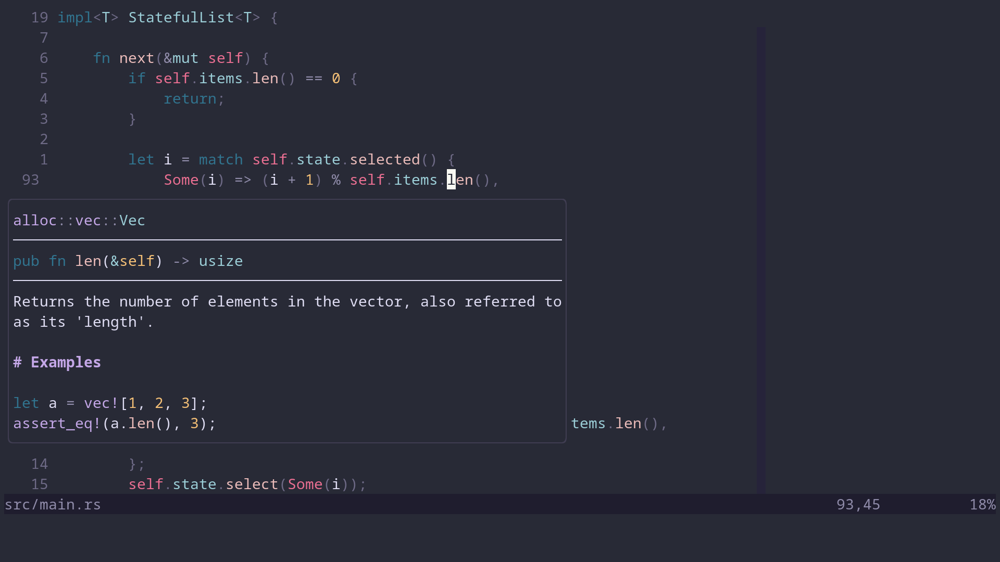
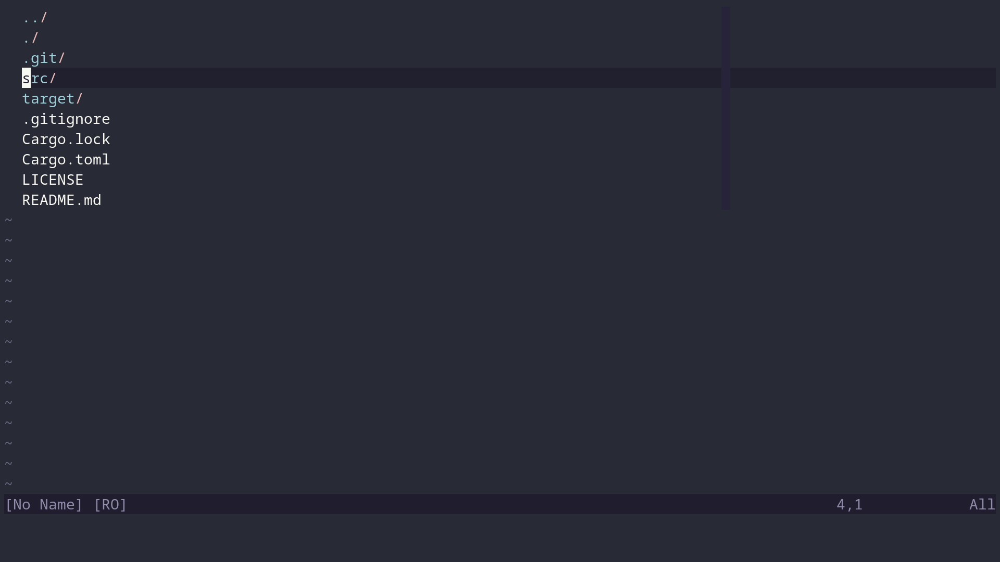
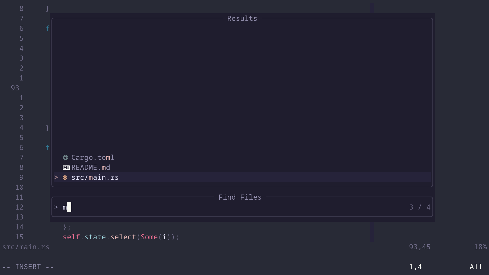

<div align="center">

# Neovim Config

##### My dotfiles for Neovim





</div>

## Installation

* [neovim 0.9.0+](https://github.com/neovim/neovim)
* [packer.nvim](https://github.com/wbthomason/packer.nvim)
* [ripgrep](https://github.com/BurntSushi/ripgrep)
* [fdfind](https://github.com/sharkdp/fd)

```console
./install.sh
```
