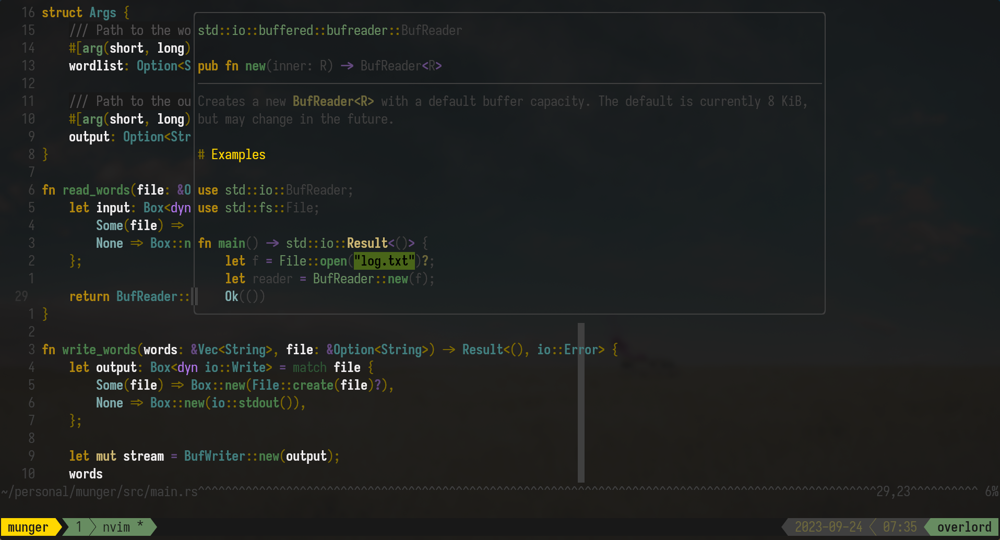
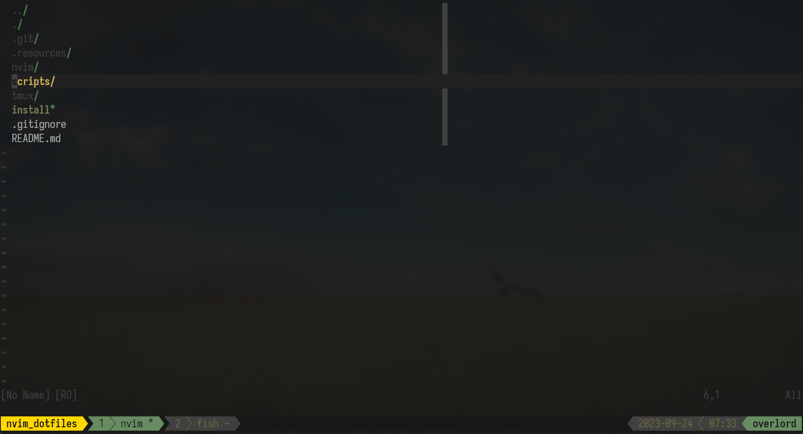

<div align="center">

# Neovim Config

##### My dotfiles for Neovim and Tmux





</div>

## Installation

* [neovim 0.9.0+](https://github.com/neovim/neovim)

```console
./install
```

## Other Dependencies

For tmux to show the correct icons in the status bar you will need a [nerd
font](https://www.nerdfonts.com/).

## Credits

- ThePrimeagen for
  [tmux-sessionizer](https://github.com/ThePrimeagen/.dotfiles/blob/master/bin/.local/scripts/tmux-sessionizer)
- i3d for [breakingbad](https://github.com/i3d/vim-jimbothemes#breakingbad)
